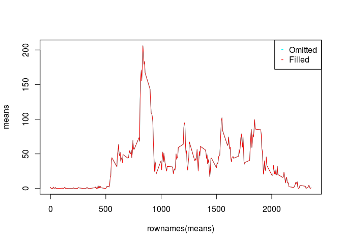

# Reproducible Research: Peer Assessment 1
Aleksej Trefilov  

## Loading and preprocessing the data

```r
data <- read.csv("activity.csv")
```

## What is mean total number of steps taken per day?
In this step we collect totals per day and display the breakdown (histogram):

```r
sums <- tapply(data$steps, data$date, sum, na.rm=TRUE) 
hist(sums)
```


Mean and median of totals per day:

```r
mean(sums)
```

```
## [1] 9354.23
```

```r
median(sums)
```

```
## [1] 10395
```

## What is the average daily activity pattern?
Collect and display means per interval across all days

```r
means <- tapply(data$steps, data$interval, mean, na.rm=TRUE) 
plot(means ~ rownames(means), type='l')
```


Show the interval that has the maximum number of steps on average.

```r
data$interval[which(means == max(means))]
```

```
## [1] 835
```

## Inputting missing values
The approach to filling missing step is to put an average for this particular interval.

```r
filldata <- data
for(i in 1:length(rownames(filldata))) 
{ 
  if(is.na(filldata$steps[i])) 
  { 
    filldata$steps[i] = means[rownames(means) == filldata$interval[i]];
  } 
}
```
This plot shows the difference between omitted and filled values.

```r
fillmeans <- tapply(filldata$steps, filldata$interval, mean, na.rm=FALSE) 
plot(means ~ rownames(means), type='l', col='cyan')
lines(fillmeans ~ rownames(fillmeans), col='red')
legend("topright", pch = '-', legend=c("Omitted", "Filled"), col=c("cyan", "red"))
```


As you can see the filled means graph is virtually the same as the omitted filled graph (since adding a mean value to a set will not change its mean).

The histogram also converts into a better normal distribution, since the omitted values are treated as zero and front load the histogram. When missing values are replaced by the average, the total distribution loads closer to the true mean.

```r
fillsums <- tapply(filldata$steps, filldata$date, sum, na.rm=TRUE) 
hist(fillsums)
```


Here are new mean and median of totals, and the measured shift compared to the totals from the omitted data.

```r
mean(fillsums)
```

```
## [1] 10766.19
```

```r
median(fillsums)
```

```
## [1] 10766.19
```

```r
mean(fillsums) - mean(sums)
```

```
## [1] 1411.959
```

```r
median(fillsums) - median(sums)
```

```
## [1] 371.1887
```

## Are there differences in activity patterns between weekdays and weekends?
Split the data into weekday/weekend subsets. Calculate interval means.

```r
enddata <- data[weekdays(as.Date(data$date))== c("Saturday", "Sunday"),]
endmeans <- tapply(enddata$steps, enddata$interval, mean, na.rm=TRUE) 
mfdata <- data[weekdays(as.Date(data$date))!= c("Saturday", "Sunday"),]
mfmeans <- tapply(mfdata$steps, mfdata$interval, mean, na.rm=TRUE)
```
Plot the data on same graph to see the difference. 

```r
par(mfrow = c(1, 2), mar = c(4, 4, 2, 1), oma = c(0, 0, 2, 0))
plot(endmeans ~ rownames(endmeans), type='l', main="Weekend")
plot(mfmeans ~ rownames(mfmeans), type='l', main="Weekday")
```


The behavioral patterns are very different. But it might be just due to the fact that weekdays represent 5 out of 7 days in a week and thus much closer to the average. For true pattern analysis, each day of the week should be plotted separately and only combined with another if the are similar.
